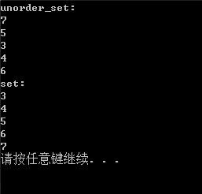

##C++11特性
###1、关键字及新语法
####1.auto关键字用法
######A、auto关键字能做什么？
答:auto并没有让C++成为弱语言，也没有弱化变量，只是使用auto的时候，编译器会根据上下文情况，确定auto变量的真正类型。
例如:
```
#include <iostream>
auto AddTest(int a,int b)
{
    return a+b;
}
int main()
{
    auto index = 10;
    auto str = "abc";
    auto ret = AddTest(1,2);
    std::cout<<"index:"<<index<<std::endl;
    std::cout<<"str:"<<str<<std::endl;
    std::cout<<"ret:"<<ret<<std::endl;
    return 0;
}
```
注:auto在C++14中可以作为返回值。
######B、auto不能干什么？
答:auto作为函数返回值时，只能用于定义函数，不能用于声明函数。
例如:
```
class Test
{
public:
    auto TestWork(int a,int b);
}
```
特殊情况:编译器可以通过实现自动推导。与inline类似
```
class Test
{
public:
    auto TestWork(int a,int b)
    {
        return a+b;
    }
}
```
####1.2、nullptr关键字及其用法
为什么要用nullptr？NULL有什么毛病？
来看一个例子:
```
#include <iostream>
class Test
{
public:
    void TestWork(int index)
    {
        std::cout<<"TestWork 1\n";
    }
    void TestWork(int *index)
    {
        std::cout<<"TestWork 2\n";
    }
}

int main()
{
    Test test;
    test.TestWork(NULL);
    test.TestWork(nullptr);
}
```

NULL是0的宏定义，本质是整型，面对函数重载时可能无法准确地调用相应的函数。
####1.3、for循环语法
例子:精简了旧式的for语句，用法类似C#/Java/boost库BOOST_FOREACH
```
#include <iostream>
int main()
{
    int numbers[] = {1,2,3,4,5};
    std::cout<<"numbers:\n";
    for(auto number:numbers)
    {
       std::cout<<number<<"\n";
    }
    return 0;
}

```
###2、STL容器
常用容器:array、vector、map/unordered_map、quere、list/forward_list,set/unordered_set
####2.1、std::array
std::array相对于普通数组增加了迭代器等函数。
```
#include <array>
#include <iostream>
int main()
{
    std::array<int,4> arrayDemo = {1,2,3,4};
    std::cout<<"array Demo:\n";
    for(auto iter:arrayDemo)
    {
        std::cout<<iter<<"\n";
    }
    std::cout<<"arrayDemo Size:"<<sizeof(arrayDemo)<<"\n";
    return 0;
}
```

####2.2、std::forward_list
std::forward_list为C++新增的线性表，与list的区别在于std::forward_list是单链表。俩表在对数据进行插入和删除是比线性存储的线性表有优势
```
#include <forward_list>
int main()
{
    std::forward_list<int> numbers = {1,2,3,4,5,4,4};
    std::cout<<"number:"<<std::endl;
    for(auto number:numbers)
    {
         std::cout<<number<<"\n";
    }
    number.remove(4);
    for(auto number:numbers)
    {
         std::cout<<number<<"\n";
    }
    return 0;
}
```

####2.3、std::unordered_map
std::map和std::unordered_map用法差不多。std::map使用的数据结构是二叉树，std::unordered_map使用的是哈希表。存储效率上哈希表需要增加哈希表的内存开销。
```
#include <iostream>
#include <string>
#include <unordered_map>
int main()
{
	std::unordered_map<std::string, std::string> mymap =
	{
		{ "house","maison" },
		{ "apple","pomme" },
		{ "tree","arbre" },
		{ "book","livre" },
		{ "door1","porte" },
		{ "door2","porte" },
		{ "grapefruit","pamplemousse" }
	};
    //unordered_map桶概念。容器内部是无序的
	unsigned n = mymap.bucket_count();
	std::cout << "mymap has " << n << " buckets.\n";
	for (auto it = mymap.begin(); it != mymap.end(); ++it) {
		std::cout << "[" << it->first << ":" << it->second << "] "<<"in bucket #"<< mymap.bucket(it->first);
		std::cout << "\n";
	}	

    //map容器内部是有序的，根据key值进行排序
    std::map<std::string, std::string> mymap1 =
	{
		{ "house","maison" },
		{ "apple","pomme" },
		{ "tree","arbre" },
		{ "book","livre" },
		{ "door1","porte" },
		{ "door2","porte" },
		{ "grapefruit","pamplemousse" }
	};
	for (auto it = mymap1.begin(); it != mymap1.end(); ++it) {
		std::cout << "[" << it->first << ":" << it->second << "] ";
		std::cout << "\n";
	}
	return 0;
}

```

运行结果可能不一样。或许是因为使用的哈希算法不一样。
####2.4、std::unordered_set
std::unorder_set的数据存储结构也是哈希表，除此之外std::unorder_set在插入时不会自动排序。
std::set是STL中一种标准关联容器。它底层使用平衡的搜索树——红黑树实现，插入删除操作时仅仅需要指针操作节点即可完成，不涉及到内存移动和拷贝，所以效率比较高。
```
#include <iostream>
#include <string>
#include <unordered_set>
#include <set>
int main()
{
    std::unordered_set<int> unorder_set;
    unorder_set.insert(7);
    unorder_set.insert(5);
    unorder_set.insert(3);
    unorder_set.insert(4);
    unorder_set.insert(6);
    std::cout << "unorder_set:" << std::endl;
    for (auto itor : unorder_set)
    {
        std::cout << itor << std::endl;
    }

    std::set<int> set;
    set.insert(7);
    set.insert(5);
    set.insert(3);
    set.insert(4);
    set.insert(6);
    std::cout << "set:" << std::endl;
    for (auto itor : set)
    {
        std::cout << itor << std::endl;
    }
    return 0;
}
```

###3、多线程
####3.1、std::thread
std::thread为C++11的线程类。得益于C++的可变参数设计风格，C++11的std::thread解决了boost::thread中构成参数的问题。
```
#include <chrono>
#include <thread>
void threadfun1()
{
    std::cout << "threadfun1 - 1\r\n" << std::endl;
    std::this_thread::sleep_for(std::chrono::seconds(1));
    std::cout << "threadfun1 - 2" << std::endl;
}

void threadfun2(int iParam, std::string sParam)
{
    std::cout << "threadfun2 - 1" << std::endl;
    std::this_thread::sleep_for(std::chrono::seconds(5));
    std::cout << "threadfun2 - 2" << std::endl;
}

int main()
{
    std::thread t1(threadfun1);
    std::thread t2(threadfun2, 10, "abc");
    t1.join();
    std::cout << "join" << std::endl;
    t2.detach();
    std::cout << "detach" << std::endl;
    return 0;
}
```

根据输出结果，t1.join()会等待t1线程退出后才继续往下执行。t2.detach()并不会，主调线程继续运行，被调线程驻留后台运行，主调线程无法再取得该被调线程的控制权。当主调线程结束时，由运行时库负责清理与被调线程相关的资源。
####3.2、std::atomic
std::atomic为C++11封装的原子数据类型。
什么是原子数据类型？
答:原子数据类型不会发生数据竞争，能直接用在多线程中而不必对其进行添加互斥资源锁的一种数据类型。
```
#include <thread>
#include <atomic>
#include <stdio.h>
std::atomic_bool bIsReady = false;
std::atomic_int iCount = 100;
void threadfun1()
{
    if (!bIsReady) {
        std::this_thread::yield();//交出当前线程从操作系统获取到的cpu运行时间片
        //由于线程是由内核调度器统一调度，每一个线程都会争抢cpu运行时间片，如果是一直等待某个结果的来临
        //那么该线程会一直占用cpu，导致运行效率下降。使用yield交出该线程的cpu运行时间片，不再由操作系统调度而
        //直接让给其他线程运行
    }
    while (iCount > 0)
    {
        printf("iCount:%d\r\n", iCount--);
    }
}

int main()
{
    std::atomic_bool b;
    std::list<std::thread> lstThread;
    for (int i = 0; i < 10; ++i)
    {
        lstThread.push_back(std::thread(threadfun1));
    }
    for (auto& th : lstThread)
    {
        th.join();
    }
}
```
####3.3、std::condition_variable
C++11中的std::condition_variable就像linux下使用pthread_cond_wait和pthread_cond_signal一样，可以让线程休眠，直到被唤醒
例子:
```
#include <iostream>           // std::cout
#include <thread>             // std::thread
#include <mutex>              // std::mutex, std::unique_lock
#include <condition_variable> // std::condition_variable
#include <chrono>

std::mutex mtx;
std::condition_variable cv;
bool ready = false;

int main()
{
	std::thread threads[10];
	for (int i = 0; i < 10; ++i)
		threads[i] = std::thread([&] (int id)
		{
			std::unique_lock<std::mutex> lck(mtx);
			while (!ready) cv.wait(lck);
			std::cout << "thread:" << id << "\n";
		}, i);	
	//休眠5秒
	std::this_thread::sleep_for(std::chrono::seconds(5));
	//即刻执行匿名函数，唤醒线程
	[](){
		 std::unique_lock<std::mutex> lck(mtx);
		 ready = true;
		 cv.notify_all();
	}();//加括号表示即刻执行

	for (auto& th : threads) th.join();
	return 0;
}
```

运行结果显示，线程中调用cv.wait()的时候，线程将进入休眠。等待5s后，进入匿名函数即刻执行，调用cv.notify_all()后，所有线程都被唤醒继续执行。
###4、智能指针内存管理
在内存管理方面，C++的std::auto_ptr(C++17已移除)基础上，移植boost库中的智能指针的部分实现，如std::shart_ptr、std::weak_ptr等。
A、什么是智能指针？
答:智能指针是用对象去管理一个资源指针，同时用一个计数器计算当前引用对象的个数，当管理指针的对象增加或者减少时，计数器也相应的增加或减少，当计数器为0时，智能指针将对管理的对象进行delete操作。
B、智能指针一定不会内存泄漏吗？
答:智能指针只是帮助我们避免内存泄漏，但并不能完全做到不会内存泄漏。比如:std::shared_ptr指针的相互引用问题
####4.1、std::share_ptr
std::shared_ptr包装了new操作符动态分配内存，可以自由拷贝复制。
std::shared_ptr是一个引用计数型智能指针，被引用后会增加对象的引用计数，即强引用。
```
#include <memory>
namespace t1
{
	class Test
	{
	public:
		Test()
		{
			std::cout << "Test()" << std::endl;
		}
		~Test()
		{
			std::cout << "~Test()" << std::endl;
		}
	};
}
int main()
{
	using namespace t1;
	using namespace std;
	std::shared_ptr<Test> p1 = std::make_shared<Test>();
	std::cout << "1 ref:" << p1.use_count() << std::endl;
	{
		cout << "进入局部作用域\n";
		std::shared_ptr<Test> p2 = p1;
		std::cout << "2 ref:" << p1.use_count() << std::endl;
		cout << "离开局部作用域\n";
	}
	std::cout << "3 ref:" << p1.use_count() << std::endl;
}
```

使用std::shared_ptr应该注意:
1.不要用一个原始指针初始化多个shared_ptr。
2.不要再函数实参中创建shared_ptr，在调用函数之前先定义以及初始化它。
3.不要将this指针作为shared_ptr返回出来。
4.要避免循环引用
####4.2、std::weak_ptr
std::weak_ptr也是一个引用计数型智能指针，但是它不增加对象的引用计数，即弱引用。大部分的作用是用来避免std::shared_ptr的循环引用问题
例子:std::share_ptr相互引用的问题
```
#include <iostream>
#include <memory>
namespace t2
{
	class TestB;
	class TestA
	{
	public:
		TestA() { std::cout << "TestA construct!\n"; }
		void RefPtr(std::shared_ptr<TestB> smPtr) { m_ptrB = smPtr; }
		~TestA() { std::cout << "TestA Destruct!\n"; }
	private:
		std::shared_ptr<TestB> m_ptrB;
	};

	class TestB
	{
	public:
		TestB() { std::cout << "TestB construct!\n"; }
		void RefPtr(std::shared_ptr<TestA> smPtr) { m_ptrA = smPtr; }
		~TestB() { std::cout << "TestB Destruct!\n"; }
	private:
		std::shared_ptr<TestA> m_ptrA;
	};
}

int main()
{
	using namespace t2;
	using namespace std;
	shared_ptr<TestA> ptrA = make_shared<TestA>();
	shared_ptr<TestB> ptrB = make_shared<TestB>();
	ptrA->RefPtr(ptrB);
	ptrB->RefPtr(ptrA);

	//发现析构函数没有执行!!!
	//查看一下此时的引用计数
	cout << "当前A指针引用计数:" << ptrA.use_count()<<"\n";
	cout << "当前B指针引用计数:" << ptrB.use_count() << "\n";
	//引用计数都是2，此时产生环形引用，可能产生内存泄漏
    return 0;
}

```

从运行结果来看，两个对象都没有被析构。原因是引用计数都是2，即时在退出main函数后，引用计数仍然为1，就是相互应用。此时产生了释放冲突，最终可能导致内存泄漏。
例子2:使用弱引用智能指针std::weak_ptr解决std::shared_ptr环形引用问题。
```
#include <iostream>
#include <memory>
namespace t2
{
	class TestB;
	class TestA
	{
	public:
		TestA() { std::cout << "TestA construct!\n"; }
		void RefPtr(std::shared_ptr<TestB> smPtr) { m_ptrB = smPtr; }
		~TestA() { std::cout << "TestA Destruct!\n"; }
		void TestWork()
		{
			std::cout << "~TestA::TestWork()" << std::endl;
		}
	private:
		std::weak_ptr<TestB> m_ptrB;//此处使用weak_ptr
	};

	class TestB
	{
	public:
		TestB() { std::cout << "TestB construct!\n"; }
		void RefPtr(std::shared_ptr<TestA> smPtr) { m_ptrA = smPtr; }
		~TestB() 
		{
			//通过weak_ptr调用A对象函数
			std::shared_ptr<TestA> tmpPtr = m_ptrA.lock();
			tmpPtr->TestWork();
			std::cout << "TestB Destruct!\n";
		}
	private:
		std::weak_ptr<TestA> m_ptrA;//此处使用weak_ptr
	};
}

int main()
{
	using namespace t2;
	using namespace std;
	shared_ptr<TestA> ptrA = make_shared<TestA>();
	shared_ptr<TestB> ptrB = make_shared<TestB>();
	ptrA->RefPtr(ptrB);
	ptrB->RefPtr(ptrA);

	cout << "当前A指针引用计数:" << ptrA.use_count()<<"\n";
	cout << "当前B指针引用计数:" << ptrB.use_count() << "\n";
}

```

###5、其他
主要包含std::function、std::bind、和lamda表达式。
####5.1、std::function、std::bind封装可执行对象
```
#include <functional>
namespace t3
{
	class Test
	{
	public:
		void Add(std::function<int(int, int)>fun, int a, int b)
		{
			int sum = fun(a, b);
			std::cout << "sum:" << sum << "\n";
		}
	};
	class TestAdd
	{
	public:
		int Add_(int a, int b)
		{
			return a + b + 1;
		}
	};
	int _Add(int a, int b)
	{
		return a + b + 2;
	}
}

int main()
{
	using namespace t3;
	using namespace std;
	Test ts1;
	TestAdd tsAdd1;
	ts1.Add(_Add, 1, 2);
	ts1.Add(std::bind(&TestAdd::Add_, tsAdd1,std::placeholders::_1,std::placeholders::_2),3, 4);

	return 0;
}
```

解释:std::bind的第一个参数为对象函数指针，表示函数相对于类的首地址的偏移量。testAdd为对象指针;std::placeholders::_1和std::placeholders::_2为参数占位符，表示std::bind封装的执行对象可以接受两个参数。
####5.3、lamda表达式
```
#include <functional>
namespace t3
{
	class Test
	{
	public:
		void Add(std::function<int(int, int)>fun, int a, int b)
		{
			int sum = fun(a, b);
			std::cout << "sum:" << sum << "\n";
		}
	};
	class TestAdd
	{
	public:
		int Add_(int a, int b)
		{
			return a + b + 1;
		}
	};
	int _Add(int a, int b)
	{
		return a + b + 2;
	}
}
int main()
{
	using namespace t3;
	using namespace std;
	Test ts1;
	ts1.Add([&](int a, int b)->int {return a + b + 3; }, 5, 6);
	return 0;
}
```
####5.3、C++11可变模板参数
```
//递归终止函数
void debug()
{
	cout << "empty\n";
}
;
//展开函数
template <class T, class ... Args>
void debug(T first, Args ... last)
{
	cout << "size " << sizeof...(last)<< endl;
	cout << "parameter " << first << endl;
	debug(last...);
}
int main()
{
	string s = "world";
	debug(1, 2, 3, 4,"hello",s);
	return 0;
}
```

