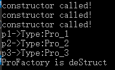

#设计模式
##1、工厂模式
###1.1、简单工厂模式
特点:需要在工厂类中做判断，从而创造相应的产品，当增加新产品时需要修改工厂类。
缺点:工厂类集中了所有产品类的创建逻辑，如果产品量大，会使得工厂类非常臃肿。
```
namespace p1
{
	//简单工厂模式
//产品枚举
	typedef enum
	{
		Pro_1,
		Pro_2,
		Pro_3
	}ProDuct_Type;
	//抽象产品类
	class ProDuct
	{
	public:
		virtual std::string type() = 0;
	};
	//产品1
	class ProDuct_1 :public ProDuct
	{
	public:
		std::string type() override
		{
			return std::string("Pro_1");
		}
		static ProDuct_1* CreateInstance()
		{
			if (instance)
				return instance;
			return new ProDuct_1;
		}
		static void ReleaseInstance()
		{
			if (instance)
			{
				delete instance;
				instance = nullptr;
			}
		}
	private:
		ProDuct_1() { std::cout << "constructor called!" << std::endl; }
		ProDuct_1(ProDuct_1&) = delete;
		ProDuct_1& operator=(const ProDuct_1&) = delete;
		static ProDuct_1 *instance;
	};
	ProDuct_1* ProDuct_1::instance = nullptr;

	//产品2
	class ProDuct_2 :public ProDuct
	{
	public:
		std::string type() override
		{
			return std::string("Pro_2");
		}
		static ProDuct_2* CreateInstance()
		{
			if (instance)
				return instance;
			return new ProDuct_2;
		}
		static void ReleaseInstance()
		{
			if (instance)
			{
				delete instance;
				instance = nullptr;
			}		
		}
	private:
		ProDuct_2() { std::cout << "constructor called!" << std::endl; }
		ProDuct_2(ProDuct_1&) = delete;
		ProDuct_2& operator=(const ProDuct_2&) = delete;
		static ProDuct_2 *instance;
	};
	ProDuct_2* ProDuct_2::instance = nullptr;

	//产品3
	class ProDuct_3 :public ProDuct
	{
	public:
		std::string type() override
		{
			return std::string("Pro_3");
		}
		static ProDuct_3* CreateInstance()
		{
			if (instance)
				return instance;
			return new ProDuct_3;
		}
		static void ReleaseInstance()
		{
			if (instance)
			{
				delete instance;
				instance = nullptr;
			}
		}
	private:
		ProDuct_3(){ std::cout << "constructor called!" << std::endl; }
		ProDuct_3(ProDuct_3&) = delete;
		ProDuct_3& operator=(const ProDuct_3&) = delete;
		static ProDuct_3 *instance;
	};
	ProDuct_3* ProDuct_3::instance = nullptr;

	//工厂
	class ProFactory
	{
	public:
		ProDuct* CreatPro(ProDuct_Type _type)
		{
			switch (_type)
			{
			case Pro_1:
				return ProDuct_1::CreateInstance();
			case Pro_2:
				return ProDuct_2::CreateInstance();
			case Pro_3:
				return ProDuct_3::CreateInstance();
			default:
				return nullptr;
			}
		}
		void DeletePro(ProDuct_Type _type)
		{
			switch (_type)
			{
			case Pro_1:
				 ProDuct_1::ReleaseInstance();
			case Pro_2:
				 ProDuct_2::ReleaseInstance();
			case Pro_3:
				 ProDuct_3::ReleaseInstance();
			default:
				;
			}
		}
		~ProFactory() { std::cout << "ProFactory is deStruct\n"; }
	};
}


int main()
{
	using namespace p1;
	using namespace std;

	std::shared_ptr<ProFactory> pF = std::make_shared<ProFactory>();
	ProDuct *p1 = pF->CreatPro(Pro_1);
	ProDuct *p2 = pF->CreatPro(Pro_2);
	ProDuct *p3 = pF->CreatPro(Pro_3);

	cout << "p1->Type:" << p1->type()<<"\n";
	cout << "p2->Type:" << p2->type() << "\n";
	cout << "p3->Type:" << p3->type() << "\n";

	pF->DeletePro(Pro_1);
	pF->DeletePro(Pro_2);
	pF->DeletePro(Pro_3);

	return 0;
}
```

##2、策略模式
策略模式是指定义一系列的算法，把它们单独封装起来，并使它们可以相互替换，使得算法可以独立于使用它们的客户端变化。这些算法所完成的功能类型是一样的，对外接口也是一样的，只是不同的策略在不同的情况表现出不同的行为。
缺点:可能需要定义大量的策略类，并且这些策略都要提供给客户端。
```
#include <iostream>
#include <functional>
namespace c2
{
	//事件1
	class InfoOne
	{
	public:
		typedef bool(*Function)(std::string);
		bool InfoProcess(Function fun)
		{
			bool ret = fun("加血");
			std::cout << "执行加血结果:" << ret << "\n";
			return ret;
		}
		~InfoOne() { std::cout << "InfoOne已经完成析构\n"; }
	};

	class InfoTwo
	{
	public:
		typedef std::function<bool(std::string)> Function;
		bool InfoProcess(Function fun)
		{
			bool ret = fun("扣血");
			std::cout << "执行扣血结果:" << ret << "\n";
			return ret;
		}
		~InfoTwo() { std::cout << "InfoTwo已经完成析构\n"; }
	};

	//加血函数
	bool AddBlood(std::string str)
	{
		std::cout << "当前执行动作:" << str << "\n";
		if (str != "加血")
		{
			std::cout << "这是加血函数，调用错了\n";
			return false;
		}
		std::cout << "回血成功\n";
		return true;
	}

	//扣血函数
	bool DeleteBlood(std::string str)
	{
		std::cout << "当前执行动作:"<< str<<"\n";
		if (str != "扣血")
		{
			std::cout << "这是扣血函数，调用错了\n";
			return false;
		}
		std::cout << "扣血成功\n";
		return true;
	}
}
int main()
{
	using namespace c2;
	using namespace std;
	std::shared_ptr<InfoOne> ifOne = std::make_shared<InfoOne>();
	std::shared_ptr<InfoTwo> ifTwo = std::make_shared<InfoTwo>();
	ifOne->InfoProcess(AddBlood);
	ifOne->InfoProcess(DeleteBlood);

	ifTwo->InfoProcess(AddBlood);
	ifTwo->InfoProcess(DeleteBlood);

	//ifOne强行扣血
	//ifOne->InfoProcess([&](std::string str)->bool {return true; });//因为是原生函数指针所以不支持lambda，强行扣血失败

	//ifTwo强行加血
	ifTwo->InfoProcess([&](std::string str)->bool {std::cout << "当前执行动作:" << str << "\n"; std::cout << "强行回血成功\n"; return true; });//std::function无所不能，想怎么改就怎么改

	return 0;
}
```

##3、单例模式
单例模式:保证一个类仅可以有一个实例化对象，并且提供一个可以访问它的全局接口。
+ 实现单例模式注意一下几点:
	+ 单例类只能有一个实例化对象。
	+ 单例类必须自己提供一个实例化对象。
	+ 单例类必须提供一个可以访问唯一实例化对象的接口。
+ 
单例模式分为懒汉和饿汉单例模式。
###3.1、懒汉单例模式
懒汉:不到万不得已不会去实例化类，第一次用到的时候才能实例化对象。在访问量较小，甚至不可能去访问的情况下，采用懒汉实现，这是以时间换空间。
####3.1.1、非线程安全的懒汉单例模式
```
class ProDuct
{
public:
	static ProDuct* CreateInstance()
	{
		if (instance)
			return instance;
		instance = new ProDuct;
		return instance;
	}
	static void ReleaseInstance()
	{
		if (instance)
		{
			delete instance;
			instance = nullptr;
		}
	}
private:
	ProDuct() { std::cout << "constructor called!" << std::endl; }
	ProDuct(ProDuct&) = delete;
	ProDuct& operator=(const ProDuct&) = delete;
	static ProDuct *instance;
};
ProDuct* ProDuct::instance = nullptr;
```
####3.1.2线程安全单例模式
```
#include <mutex>
std::mutex mt;
class ProDuct
{
public:
	static ProDuct* CreateInstance()
	{
		if (instance)
			return instance;
		mt.lock();
		instance = new ProDuct;
		mt.unlock();
		return instance;
	}
	static void ReleaseInstance()
	{
		if (instance)
		{
			delete instance;
			instance = nullptr;
		}
	}
private:
	ProDuct() { std::cout << "constructor called!" << std::endl; }
	ProDuct(ProDuct&) = delete;
	ProDuct& operator=(const ProDuct&) = delete;
	static ProDuct *instance;
};
ProDuct* ProDuct::instance = nullptr;
```
####3.1.3、返回一个引用指向local static对象的单例模式
上面3.1.1和3.1.2都是通过new创建对象，这样的方式在多线程可能存在不确定性:任何一种non-const static对象，不论是local或non-local，在多线程环境下"等待某事发生"都会有麻烦。解决办法是使用static静态对象，全局且唯一，而且还不用delete。
```
class ProDuct
{
public:
	static ProDuct& CreateInstance()
	{
		static ProDuct instance
		return instance;
	}
private:
	ProDuct() { std::cout << "constructor called!" << std::endl; }
	ProDuct(ProDuct&) = delete;
	ProDuct& operator=(const ProDuct&) = delete;
};
```
###3.2、饿汉单例模式
饿汉:在单例类定义时就进行实例化。在访问量大时或者访问线程比较多时，采用饿汉实现，可以获得更好的性能。这是以空间换时间。
```
class ProDuct
{
public:
	static ProDuct* CreateInstance()
	{
		return instance;
	}
private:
	ProDuct() { std::cout << "constructor called!" << std::endl; }
	ProDuct(ProDuct&) = delete;
	ProDuct& operator=(const ProDuct&) = delete;
	static ProDuct *instance;
};
ProDuct* ProDuct::instance = new ProDuct;
```
##4、迭代器模式
迭代器模式(Iterator Pattern) ：提供一种方法来访问聚合对象，而不用暴露这个对象的内部表示，其别名为游标(Cursor)。
##5、C++反射机制
反射:指程序在运行时动态获取对象属性与方法的一种机制，即编译器需要将类型信息(属性类型与偏移地址以及成员函数的地址等信息)编译到程序文件中，当程序运行时将这些信息加载到内存中去，做到运行时只根据对象的地址或引用就可以获取到对象的类型信息，从而利用这些信息达到修改或重建对象的目标。
### 例子:
[C++反射.h](./src/C++反射.h)
[C++反射.hpp](./src/C++反射.hpp)