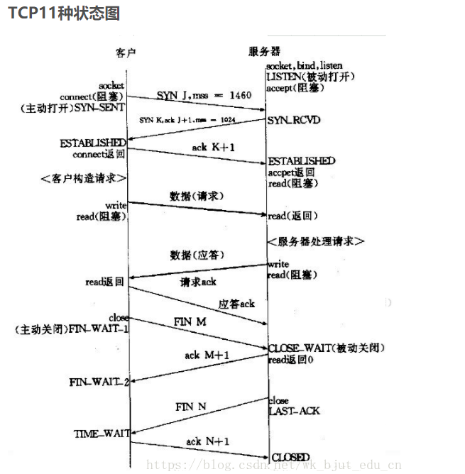

#常见问题
##1.C和C++的主要区别？
- C是面向过程的设计，更注重于程序设计的算法。
- C++是多语种的集合，包含C的面向对象，也包含Object形式的面向对象、还有模板。注重是的多态、封装、继承

##2.多态的概念
- 通过虚函数绑定 实现运行时多态(动态多态)
- 通过函数重载和范型编程 实现编译时多态(静态多态)

##3.单链表和双链表的区别
- 单链表:单向、易增删、仅单向读取
- 双链表:双向、易查询、双向读取

##4.STL常用容器有哪些?vertor和list有什么区别？
- vector:动态数组
- list:双向链表
- 问数组与链表的区别？
	- 数组:易查询
	- 链表:易增删
	
##5.单例模式饿汉和懒汉的区别？
- 懒汉:不到万不得已不会去实例化类，第一次用到的时候才能实例化对象。在访问量较小，甚至不可能去访问的情况下，采用懒汉实现，这是以时间换空间。
- 饿汉:在单例类定义时就进行实例化。在访问量大时或者访问线程比较多时，采用饿汉实现，可以获得更好的性能。这是以空间换时间。

##6.工厂模式的理解
- 解决产品类型中大量的if-else以及增删子类的时候造成系统更新和维护的问题
- 简单工厂:是由一个工厂对象创建产品实例，简单工厂模式的工厂类一般是使用静态方法，通过不同的参数的创建不同的对象实例可以生产结构中的任意产品，不能增加新的产品
- 抽象工厂:提供一个创建一系列相关或相互依赖对象的接口，而无需制定他们具体的类.

##7.了解lua的哪些概念
- 小型轻量化脚本 也可以作为配置文件替代xml、ini
- 解释器是标准C编写，易集成到C/C++项目中，反之lua也可以调用C/C++
- 支持面相过程编程和函数式编程，支持闭包，自动内存管理等

##8.如何理解闭包
- 函数是代码，状态是一组变量，将代码和一组变量捆绑 (bind) ，就形成了闭包。
- 内部包含 static 变量的函数，不是闭包， 因为这个 static 变量不能捆绑。你不能捆绑不同的 static 变量，这个在编译的时候已经确定了。
- 闭包和对象类似，都是运行时占用内存空间。
- C++是静态语言,闭包是动态行为，C++是通过模拟来实现闭包。静态语言模拟动态语言的行为都将导致性能下降。 
- C++模拟闭包实现:C++98以前使用仿函数(重载小括号)、C++11之后使用lambda表达式和std::bind函数

##9.qt中的两种线程使用方法
- 1.子类化QThread的方法，就是重写了QThread中的run()函数，在run()函数中定义了需要的工作。这样的结果是，我们自定义的子线程调用start()函数后，便开始执行run()函数。如果在自定义的线程类中定义相关槽函数，那么这些槽函数不会由子类化的QThread自身事件循环所执行，而是由该子线程的拥有者所在线程（一般都是主线程）来执行。
- 2.moveToThread方法，是把我们需要的工作全部封装在一个类中，将每个任务定义为一个的槽函数，再建立触发这些槽的信号，然后把信号和槽连接起来，最后将这个类调用moveToThread方法交给一个QThread对象，再调用QThread的start()函数使其全权处理事件循环。于是，任何时候我们需要让线程执行某个任务，只需要发出对应的信号就可以。其优点是我们可以在一个worker类中定义很多个需要做的工作，然后发出触发的信号线程就可以执行。相比于子类化的QThread只能执行run()函数中的任务，moveToThread的方法中一个线程可以做很多不同的工作（只要发出任务的对应的信号即可）。 

##10.qt信号槽和回调函数的区别
- 回调是指向函数的指针,把这个指针传递给一个要被处理的函数,就可以在这个函数被处理的时候调用回调函数
- QT中应用信号槽机制实现对象间的通信, MFC中应用回调机制实现对象之间的通信。在QT中应用事件机制实现外部事件, MFC中应用消息响应机制处理外部事件
- 为什么qt不用回调而用信号槽？	
	- qt其实也可以用回调来实现类似信号槽的功能，但是回调函数是由别人提供的函数指针，且还要维护一个指针表，用来存储回调函数的地址，只要使用该回调的类，都需要做类似的工作,不灵活且效率低。
	- qt使用的信号槽是为了解决回调函数的问题。只需要指定一个类有哪些信号函数和槽函数，qt会处理其之间的绑定。而且信号槽有效降低qt对象的耦合度，即时关联对象被删除也不会引起程序的崩溃。但是回调不同，通过指针去索引对应的执行函数，一旦指针被删除或目标对象被释放，调用方完全不知道，这时将会引起程序崩溃。

##11.qt信号槽机制的优势与不足
- 优点:类型安全，松散耦合。
- 缺点:同回调函数相比，运行速度慢。

##12.static和const的使用
- static:静态变量声明。
	- 局部静态变量:存储在静态存储区。运行期只被初始化一次,当函数销毁后，一直存在于内存中，此时该变量便不能使用，直到程序程序结束由系统回收资源。
	- 全局静态变量:存储在静态存储区。运行期会一直存在，最终程序结束由系统回收资源。未初始化的变量会为0，作用域在声明的文件中有效。
	- 类静态成员变量:所有对象间共享，包括子对象。必须在类外初始化。
	- 类静态成函数:所有对象共享改函数，不含this指针，不可使用类中非静态成员。
- const:在 C++ 中是修饰符，被修饰的东西访问权限将变为只读

##13.tcp状态有哪些，这些状态是怎么产生的和怎么处理这些状态？
- TCP一共有11种状态:
	- 1.CLOSED:初始状态,表示TCP连接未打开
	- 2.LISTEN:表示服务端的某个SOCKET处于监听状态
	- 3.SYN_RCVD:表示服务器接收到了来自客户端请求连接的SYN报文
	- 4.SYN_SENT:这个状态与SYN_RCVD相呼应，当客户端SOCKET执行connect()发送SYN报文时，随即进入SYN_SENT
	- 5.ESTABLISHED:表示TCP连接已成功建立
	- 6.FIN_WAIT_1:当Socket在ESTABLISHED状态时，它想主动关闭连接，向对方发送了FIN报文，此时进入FIN_WAIT_1状态.
	- 7.FIN_WAIT_2:在FIN_WAIT_1状态下，收到对方回复ACK报文，随即进入FIN_WAIT_2状态
	- 8.TIME_WAIT:表示收到对方的FIN报文，并发送出了ACK报文，此时进入TIME_WAIT状态。在FIN_WAIT_1状态下，收到对方同时携带FIN和ACK报文时，直接进入TIME_WAIT状态
	- 9.CLOSING:表示对方发出FIN报文后，没有收到对方的ACK报文，却收到了FIN报文，此刻进入CLOSING状态。表明双方正在close同一个Socket,此时就会出现双方同时发送FIN报文。
	- 10.CLOSE_WAIT:当收到对方FIN报文后，并给对方回复ACK,此时进入CLOSE_WAIT状态。如果对方收到ACK报文则随即变成FIN_WAIT_2状态
	- 11.LAST_ACK:如果客户端主动关闭，则服务端则属于被动关闭。当被动关闭方发出FIN报文后，在等待ACK报文时，进入LAST_ACK状态

##14.虚函数表和虚函数指针存放在哪里？
- 虚函数表存放位置？ 
	- 虚函数表类似一个数组。虚函数表不是函数，不是程序代码，所以不存于代码段。
	- 虚函数表存储着虚函数的地址，并且类中的虚函数个数在编译期就确定。即虚函数表的大小在编译时就是确定的，无需再分配存储空间，所以也不在堆栈中。
	- 虚函数全局存在，且大小确定，所以是静态成员变量，存放在静态存储区
- 虚函数指针存在位置？
	- 虚函数指针堆在于类对象中，当对象被创建于堆中，则虚函数指针则存放于堆中。当对象被创建于栈中，则虚函数指针则存放于栈中。

##15.策略模式的应用场景
- 场景一:一个应用程序有app分享功能，例如可以分享到:微信、qq、微博等，后续产品也不确定是否会增加支付宝、新浪等入口。如果采用常规设计，后续扩展可能不是很方便。此时采用策略模式，抽象分享功能接口，将分享策略进行独立封装，由抽象接口统一调度。
- 场景二:程序需要接入某个支付平台。例如:支付宝、微信等。后续不确定是否会增加云闪付等入口。此时也采用策略模式，抽象支付接口，将支付策略挨个独立封装，由抽象接口统一调度。